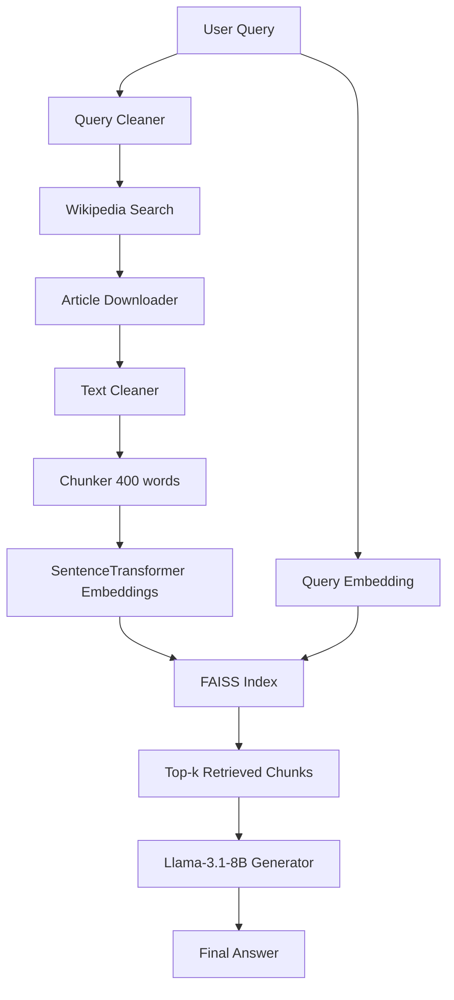

# 🧠 Wikipedia RAG Chatbot (Ukrainian)  
**Retrieval-Augmented Generation system which uses Wikipedia articles as a Knowledge base.**

---

## Project Overview

This project implements a **full-fledged Retrieval-Augmented Generation (RAG)** system designed to answer user questions based on information retrieved from **Ukrainian Wikipedia**.

The system:

- Searches Wikipedia articles based on the user's question  
- Downloads and cleans article text  
- Splits articles into semantic chunks  
- Encodes them with SentenceTransformer  
- Builds a FAISS vector index  
- Retrieves relevant chunks to a user question  
- Generates an answer using **Qwen2.5-3B-Instruct**  

## System Architecture




## Repo Structure

```
search-answer-from-wikipedia-RAG/
├── main.ipynb               # Main file with all Python scripts
├── Wiki_test_dataset.csv    # Test dataset which contains 53 qustions of different types
├── LLMs experiments.xlsx    # Table with log of experiments of using different LLMs
├── .gitignore               # Files ignored by Git
├── LICENSE                  # MIT Licence
├── README.md                # Project documentation
```
